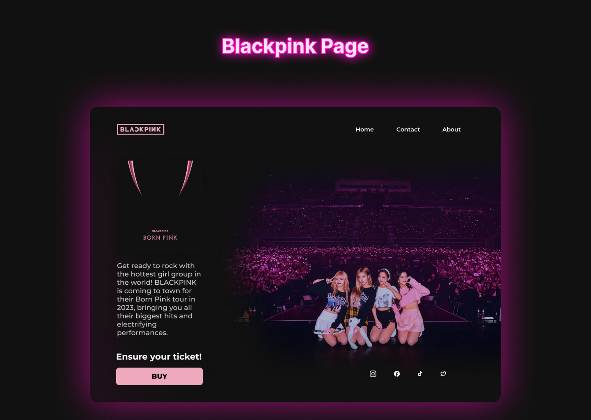

                                                                                                              

>Blackpink Page

Desafio  - DIO
No curso de Formação Angular na DIO o desafio foi desenvolver um site usando o que aprendemos até o momento no curso.
Para cumprir o desafio, eu usei o design de um projeto que já tinha feito anteriormente e agora aplicando o que aprendi de desenvolvimento web e design nos últimos meses. 

:tools:Tecnologias
-Figma
-Photoshop
-Html
-Css
-Typescript
-Angular
-Bootstrap
-Git e GitHub

